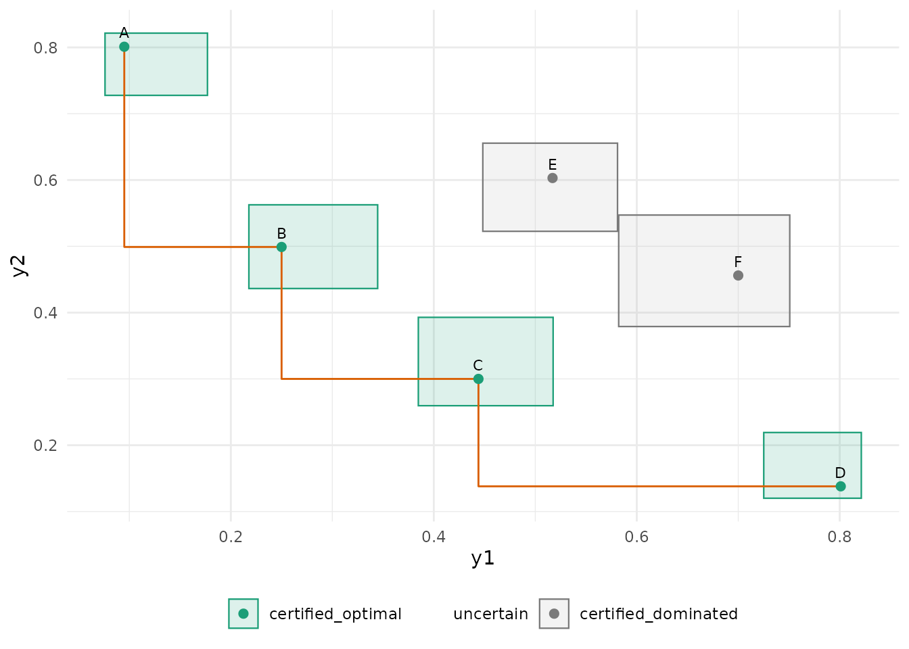
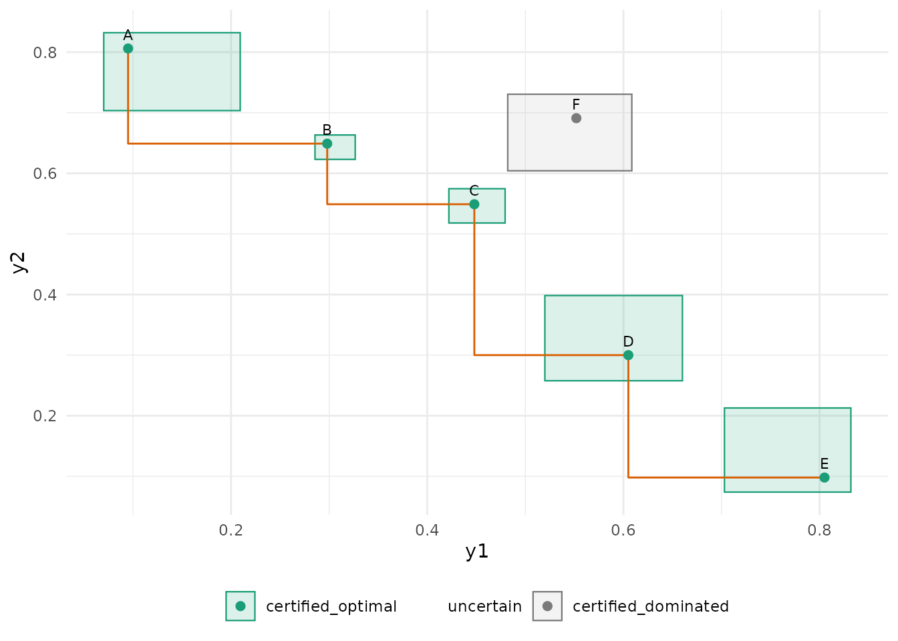
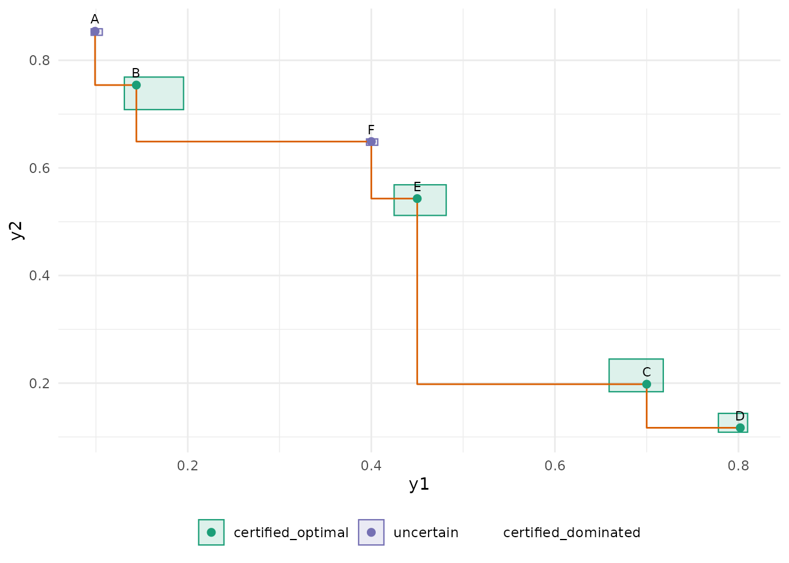

# Frontier shapes and near-ties

``` r

library(paretoinfer)
```

Identification with confidence boxes does not care whether the frontier
is convex: a certificate compares two boxes, objective by objective.
This vignette runs the procedure on the frontier shapes that trouble
scalarised methods (weighted sums find only the convex hull) and on
near-ties, and shows what the three sets look like in each case.

``` r

make_sim <- function(means, h = 0.08) {
  function(alternative, n) {
    mu <- means[alternative, ]
    data.frame(y1 = runif(n, mu[1] - h, mu[1] + h), y2 = runif(n, mu[2] - h, mu[2] + h))
  }
}
run <- function(means, epsilon = 0.04, seed = 1, ...) {
  d <- pareto_design(alternatives = rownames(means), objectives = c("y1", "y2"),
                     bounds = c(0, 1), alpha = 0.05, epsilon = epsilon, max_evaluations = 4000, ...)
  set.seed(seed)
  pareto_run(d, make_sim(means), batch = 5, initial = 5)
}
```

## Convex frontier

``` r

convex <- rbind(A = c(0.10, 0.80), B = c(0.25, 0.50), C = c(0.45, 0.30), D = c(0.80, 0.15),
                E = c(0.50, 0.60), F = c(0.70, 0.45))
s <- run(convex)
plausible_pareto_set(s)
#> 
#> ── Pareto sets ──
#> 
#> • Estimated frontier: "A", "B", "C", and "D"
#> • Plausible: "A", "B", "C", and "D"
#> • Certified optimal: A, B, C, D
#> • Uncertain: none
#> • Certified dominated: E, F
#> ✔ Identified: every alternative is certified.
autoplot(s)
```



## Concave (non-convex) frontier

The middle alternative `C` is Pareto-optimal but lies above the segment
that joins its neighbours, so no weighted sum of the objectives would
select it. The boxes certify it without difficulty.

``` r

concave <- rbind(A = c(0.10, 0.80), B = c(0.30, 0.65), C = c(0.45, 0.55), D = c(0.60, 0.30),
                 E = c(0.80, 0.10), F = c(0.55, 0.70))
s <- run(concave)
plausible_pareto_set(s)$table[, c("alternative", "status", "dominated_by", "n_evaluations")]
#> # A tibble: 6 × 4
#>   alternative status              dominated_by n_evaluations
#>   <chr>       <chr>               <chr>                <int>
#> 1 A           certified_optimal   NA                      90
#> 2 B           certified_optimal   NA                     315
#> 3 C           certified_optimal   NA                     215
#> 4 D           certified_optimal   NA                      80
#> 5 E           certified_optimal   NA                      90
#> 6 F           certified_dominated C                       90
autoplot(s)
```



## Disconnected frontier

Two clusters of optimal alternatives with a dominated gap between them.

``` r

disconnected <- rbind(A = c(0.10, 0.85), B = c(0.15, 0.75), C = c(0.70, 0.20), D = c(0.80, 0.12),
                      E = c(0.45, 0.55), F = c(0.40, 0.65))
s <- run(disconnected)
plausible_pareto_set(s)$table[, c("alternative", "status", "dominated_by", "n_evaluations")]
#> # A tibble: 6 × 4
#>   alternative status            dominated_by n_evaluations
#>   <chr>       <chr>             <chr>                <int>
#> 1 A           uncertain         NA                    1635
#> 2 B           certified_optimal NA                     205
#> 3 C           certified_optimal NA                     210
#> 4 D           certified_optimal NA                     440
#> 5 E           certified_optimal NA                     215
#> 6 F           uncertain         NA                    1295
autoplot(s)
```



## Near-ties

Two alternatives within 0.02 of each other on both objectives, with a
tolerance of 0.04: they are an `epsilon`-tie. The procedure keeps the
first in design order as the representative and certifies the other as
dominated by it; the report names the tie. With a tolerance below the
gap the two could not be separated and the identification would run to
its budget.

``` r

ties <- rbind(A = c(0.20, 0.60), B = c(0.21, 0.61), C = c(0.60, 0.20), D = c(0.50, 0.50))
s <- run(ties, epsilon = 0.04)
plausible_pareto_set(s)$table[, c("alternative", "status", "dominated_by", "n_evaluations")]
#> # A tibble: 4 × 4
#>   alternative status              dominated_by n_evaluations
#>   <chr>       <chr>               <chr>                <int>
#> 1 A           certified_optimal   NA                     280
#> 2 B           certified_dominated A                      280
#> 3 C           certified_optimal   NA                      50
#> 4 D           uncertain           NA                    3390
s_tight <- run(ties, epsilon = 0.005)
glance(s_tight)[, c("n_evaluations", "n_uncertain", "stopping_reason")]
#> # A tibble: 1 × 3
#>   n_evaluations n_uncertain stopping_reason
#>           <int>       <int> <chr>          
#> 1          4000           1 max_evaluations
```

## Reading the plots

In every plot the boxes are the simultaneous confidence boxes, the
colour is the status, and the orange step line joins the point estimates
of the estimated frontier. A box that overlaps the region to the lower
left of another box’s corner cannot be certified dominated; a box
entirely to the upper right of another one’s upper-right corner (shifted
by `epsilon`) is.
