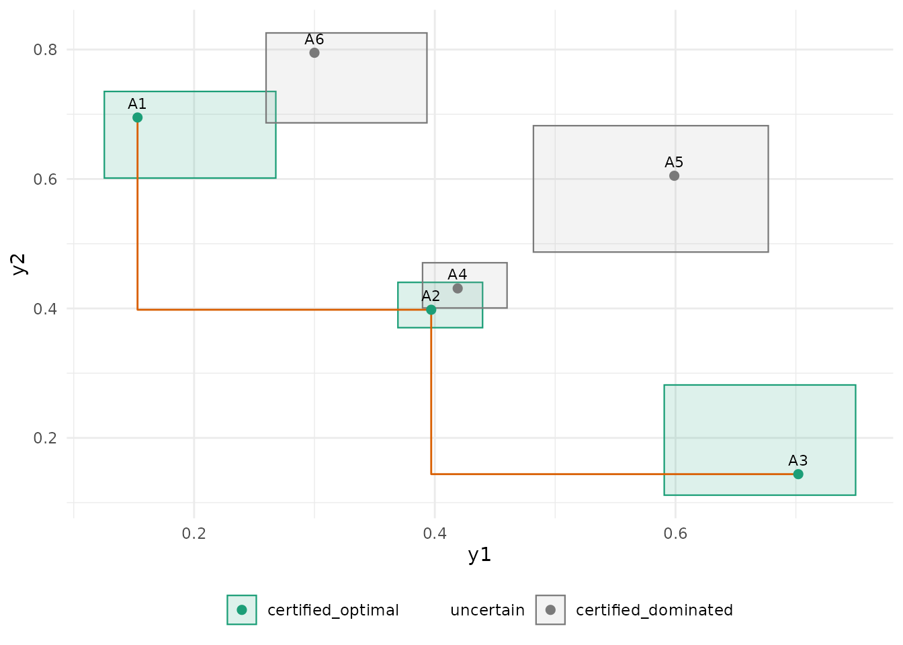

# Get started with paretoinfer

``` r

library(paretoinfer)
```

## The problem

A finite set of alternatives (algorithm variants, designs, policies) is
evaluated on several objectives through noisy simulation. With two
objectives, an alternative is *dominated* when another is at least as
good on both, and the *Pareto frontier* is the set of non-dominated
alternatives. With noise, an alternative can look dominated purely by
sampling error, and a frontier read off point estimates after a fixed
number of runs carries no guarantee.

`paretoinfer` treats the identification as a sequential experiment. It
keeps one anytime-valid confidence sequence per alternative and
objective (from the
[seqbench](https://CRAN.R-project.org/package=seqbench) package), shares
the error level `alpha` among them, and at any time reports three sets:

- the **estimated frontier**, a point estimate;
- the **plausible Pareto set**, the alternatives that cannot be
  certified as dominated, with the subset that is **certified optimal**;
- the **certified dominated** alternatives, each with the alternative
  that dominates it.

With probability at least `1 - alpha`, every certificate ever issued is
true, whatever the stopping rule and whatever is evaluated next.
Dominance is *epsilon-dominance*: `j` dominates `k` when it is at least
as good as `k` up to a tolerance `epsilon` on every objective. A
positive tolerance is what lets the procedure stop on near-ties.

## A simulated problem

Six alternatives with two objectives in \[0, 1\], both minimised. Three
are on the true frontier, one is nearly tied with a frontier
alternative, two are clearly dominated. Noise is uniform with half-width
0.1.

``` r

means <- rbind(A1 = c(0.15, 0.70), A2 = c(0.40, 0.40), A3 = c(0.70, 0.15),
               A4 = c(0.42, 0.43), A5 = c(0.60, 0.60), A6 = c(0.30, 0.80))
simulate <- function(alternative, n) {
  mu <- means[alternative, ]
  data.frame(y1 = runif(n, mu[1] - 0.1, mu[1] + 0.1),
             y2 = runif(n, mu[2] - 0.1, mu[2] + 0.1))
}
```

## Design, run, read

``` r

design <- pareto_design(alternatives = rownames(means), objectives = c("y1", "y2"),
                        bounds = c(0, 1), alpha = 0.05, epsilon = 0.05,
                        max_evaluations = 3000)
design
#> 
#> ── Pareto identification design ────────────────────────────────────────────────
#> 6 alternatives, 2 objectives (y1 and y2), all minimised.
#> Bounds: y1 in [0, 1]; y2 in [0, 1].
#> Tolerance epsilon: 0.05, 0.05; alpha 0.05 shared over 12 confidence sequences
#> (0.00417 each); boundary "betting".
#> Budget: no cost limit; 3000 evaluations at most.
set.seed(1)
state <- pareto_run(design, simulate, batch = 5, initial = 5)
state
#> 
#> ── Pareto identification ───────────────────────────────────────────────────────
#> 6 alternatives, 2 objectives, alpha 0.05, epsilon 0.05, 0.05.
#> 645 evaluations, cost 645.
#> • Estimated frontier: "A1", "A2", and "A3"
#> • Plausible Pareto set: "A1", "A2", and "A3" (certified optimal: A1, A2, A3)
#> • Certified dominated: A4, A5, A6
#> ℹ Stopped: identified.
```

The procedure evaluated every alternative five times, then repeatedly
chose the most uncertain plausible alternative per unit cost, evaluated
it five more times and updated, until every alternative was certified or
the budget ran out.

``` r

sets <- plausible_pareto_set(state)
sets$table
#> # A tibble: 6 × 7
#>   alternative status      on_estimated_frontier dominated_by n_evaluations  cost
#>   <chr>       <chr>       <lgl>                 <chr>                <int> <dbl>
#> 1 A1          certified_… TRUE                  NA                      85    85
#> 2 A2          certified_… TRUE                  NA                     175   175
#> 3 A3          certified_… TRUE                  NA                      70    70
#> 4 A4          certified_… FALSE                 A2                     175   175
#> 5 A5          certified_… FALSE                 A2                      55    55
#> 6 A6          certified_… FALSE                 A1                      85    85
#> # ℹ 1 more variable: cs_empty <lgl>
```

`A4` sits within `epsilon = 0.05` of `A2` on both objectives, so it is
certified dominated by `A2` under the tolerance; with `epsilon = 0` the
two could not be separated and the procedure would run to its budget.

## The picture is the guarantee

[`autoplot()`](https://ggplot2.tidyverse.org/reference/autoplot.html)
draws, for each alternative, the product of its two running
intersections: a box that contains the true mean vector with the
simultaneous guarantee. The boxes are what the certificates are read
from; the step line is the estimated frontier, a point estimate.

``` r

autoplot(state)
```



## Step by step

The same identification can be driven by hand, for example when
evaluations come from an external simulator or a cluster.

``` r

state <- initialize_pareto(design)
set.seed(2)
for (k in design$alternatives) {
  ev <- simulate(k, 5); ev$alternative <- k
  state <- update_objectives(state, ev)
}
choose_next_evaluation(state, n = 3)
#> # A tibble: 3 × 4
#>   alternative score width n_evaluations
#>   <chr>       <dbl> <dbl>         <int>
#> 1 A5          0.898 0.898             5
#> 2 A2          0.896 0.896             5
#> 3 A4          0.887 0.887             5
```

[`choose_next_evaluation()`](https://castlaboratory.github.io/paretoinfer/reference/choose_next_evaluation.md)
scores uncertain alternatives by the width of their confidence box per
unit cost and never proposes a certified one. The rule is a heuristic;
the validity of the certificates does not depend on it.

## The report

``` r

pareto_report(state)
#> 
#> ── Pareto identification report ────────────────────────────────────────────────
#> 6 alternatives, objectives y1 and y2, epsilon 0.05, 0.05, alpha 0.05, boundary
#> "betting".
#> 30 evaluations, cost 30; running.
#> 
#> ── Pareto sets ──
#> 
#> • Estimated frontier: "A1", "A2", and "A3"
#> • Plausible: "A1", "A2", "A3", "A4", "A5", and "A6"
#> • Certified optimal: none
#> • Uncertain: A1, A2, A3, A4, A5, A6
#> • Certified dominated: none
#> 
#> ── Assumptions ──
#> 
#> • Every objective value lies in its declared bounds; conditionally on the past,
#> each evaluation of an alternative has the alternative's mean objective vector
#> (fresh draws, any dependence between objectives).
#> • The 12 confidence sequences share alpha = 0.05 by a union bound (0.00417
#> each); with probability at least 0.95 all true means lie in their running
#> intersections at every time, and every certificate below is then true.
#> • Dominance is epsilon-dominance with epsilon = (0.05, 0.05): j dominates k
#> when mu[j] <= mu[k] + epsilon in every objective.
#> • Certified optimal means not epsilon-dominated by any other plausible
#> alternative; epsilon-ties keep their earliest member in design order.
#> • The estimated frontier is a point estimate without a certificate; the
#> plausible set and the certified sets carry the guarantee.
#> paretoinfer 0.1.0, seqbench 0.1.0, R version 4.6.1 (2026-06-24)
glance(state)
#> # A tibble: 1 × 12
#>       K     m alpha n_evaluations total_cost n_frontier n_plausible
#>   <int> <int> <dbl>         <int>      <dbl>      <int>       <int>
#> 1     6     2  0.05            30         30          3           6
#> # ℹ 5 more variables: n_certified_optimal <int>, n_uncertain <int>,
#> #   n_dominated <int>, identified <lgl>, stopping_reason <chr>
```

## What the guarantee is and is not

- It is a statement about certificates: certified dominated alternatives
  are truly `epsilon`-dominated and certified optimal ones are truly
  not, all simultaneously, with probability at least `1 - alpha`, at
  every time.
- It is not a statement about the estimated frontier, which is a point
  estimate, nor about the plausible set being small: with few
  evaluations the plausible set is everything.
- It needs the objectives of each evaluation to lie in the declared
  bounds and to have, conditionally on the past, the alternative’s mean.
  Dependence between the objectives of one evaluation is allowed; so is
  any adaptive choice of what to evaluate next.
- The level is shared by a union bound over the `K * m` confidence
  sequences, which is conservative; the price is evaluations, not
  validity.
